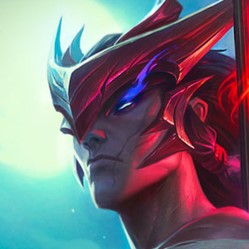
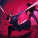

  

  
  
  
  
  
  
  

<h1 align="center">iskanye | fullstack dev</h1>

one to cut, one to seal

honor is in the heart, not the name.

  
  
  
  
  

  
  
  
  
  
  
  
  
  

  
  
  
  
  
  
  
  
  
  
  

