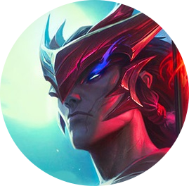

  

<h1 align="center">iskanye | fullstack dev</h1>

one to cut, one to seal honor is in the heart, not the name.

RTU MIREA student, Golang and .NET adept

<h6 align="center">former gamedev</h6>

<h3 align="center">Techonological stack</h3>

  

  

  

<h2>Selected projects</h2>

<ul>  
  <li>
    <a href="https://github.com/iskanye/mirea-queue">MIREA Queue</a>:
    telegram bot for managing queue for practical assignments
  </li>
  <li>
    <a href="https://github.com/iskanye/utilities-payment">Utilities Payment</a>:
    simulation of utilities payment service using Golang with microservices architecture
  </li>
  <li>
    <a href="https://github.com/iskanye/terminal-emulator">Terminal Emulator</a>:
    Unix terminal emulator with GUI written on Golang using <a href="https://gioui.org/">GioUI</a>
  </li>
  <li>
    <a href="https://github.com/iskanye/vkrum-project">VKRuM Project</a>:
    Game for VKRuM 2025 hackaton
  </li>
  <li>
    <a href="https://github.com/iskanye/bobs-return-plus">Bob`s Return+</a>:
    Canceled game based on animated Internet series
  </li>
  <li>
    <a href="https://github.com/iskanye/fractal-viewer">Fractal Viewer</a>:
    simple program for rendering Mandelbrot and Julia set fractals
  </li>
</ul>
